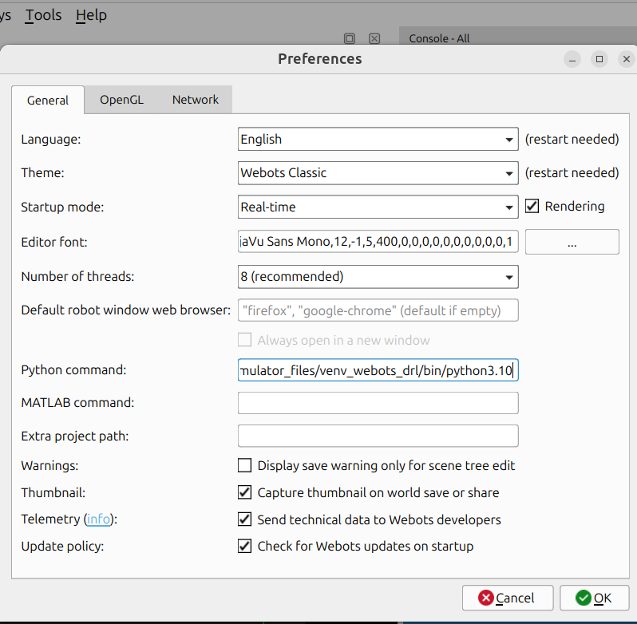

# Drone Deep Reinforcement Learning

Status: personal repository with experimental & unstable code.

## Introducción

Repositorio creado para alojar los recursos utilizados para el desarrollo de la tesis de Ana Laura Diedrichs, titulada  "Teleoperación asistida de cuadricópteros mediante aprendizaje por refuerzo profundo" de la [Carrera de Especialización en Inteligencia Artificial](https://lse-posgrados.fi.uba.ar/posgrados/especializaciones/ceia) de la Facultad de Ingeniería de la Facultad de Buenos Aires.

Este repositorio contiene el código y recursos necesarios para un simular un prototipo de un sistema de teleoperación asistida en tiempo real para cuadricópteros, basado en técnicas de aprendizaje por refuerzo profundo. Este sistema se desarrolló para la empresa Ekumen con el objetivo de mejorar la seguridad y la eficiencia de sus operaciones en entornos peligrosos o inaccesibles para los humanos.


## Tabla de Contenidos

- [Drone Deep Reinforcement Learning](#drone-deep-reinforcement-learning)
  - [Introducción](#introducción)
  - [Tabla de Contenidos](#tabla-de-contenidos)
  - [Instalación](#instalación)
  - [Configuración](#configuración)
  - [Uso](#uso)
  - [Estructura del Proyecto](#estructura-del-proyecto)
  - [Licencia](#licencia)
  - [Contacto](#contacto)

## Instalación

Para ejecutar este proyecto localmente, sigue los siguientes pasos:

1. Instala el simulador Webots [siguiendo las instrucciones según tu sistema operativo](https://cyberbotics.com/doc/guide/installation-procedure)
2. Instala Python, versión 3.7 o superior, [según las instrucciones para tu sistema operativo](https://www.python.org/downloads/). En este proyecto se utilizó Python 3.10.
3. (Recomendado, no obligatorio) Instala [PyCharm](https://www.jetbrains.com/es-es/pycharm/download) o Visual Studio Code como IDE para programar en Python.
4. Clona este repositorio:
    ```bash
    git clone https://github.com/anadiedrichs/drone-deep-rl.git
    cd drone-deep-rl
    ```
5. Crea y activa un entorno virtual:
    ```bash
    python -m venv venv
    source venv/bin/activate  # En Windows usa `venv\Scripts\activate`
    ```

6. Instala las dependencias necesarias:
    ```bash
    pip install -r requirements.txt
    ```

## Configuración

1. Webots ofrece un tutorial para integrar el uso el simulador con Pycharm, [enlace](https://cyberbotics.com/doc/guide/using-your-ide#pycharm).

2. Si ejecutas tu experimento desde Webots, configurar que use el ejecutable de Python de tu entorno virtual.

Ir a Tools --> Preferences --> General --> Python Command: coloca la ruta absoluta hacia el ejecutable de python, por ejemplo en linux podría ser /home/tu_user/your_project/your_venv/python3.10.



## Uso

Cada programa o ejemplo tiene su propio README explicando su uso.

## Estructura del Proyecto

- `0-tutorial/`: Contiene ejemplos y explicaciones del uso de Webots, Gym.Env, entre otros.
- `v1-shared-autonomy/`: Desarrollo del enfoque de autonomía compartida.
- `requirements.txt`: Archivo de dependencias necesarias para el proyecto.
- `README.md`: Este archivo.

## Licencia

Este proyecto está bajo la Licencia Apache-2.0. 

Para más detalles, revisa el archivo [LICENSE](LICENSE).

## Memoria

[Documento Memoria técnica versión al 2024-11-01](https://www.dropbox.com/scl/fi/pn8v7tif7i3exfrrzuqmh/CEIA_FIUBA_2024_memoria_20241101.pdf?rlkey=0vzd0gm51qyx5kt28umotmb3h&dl=0)

## Contacto

Para preguntas, sugerencias o comentarios, puedes contactar a:

- Ana Diedrichs - ana (dot) diedrichs (at) docentes.frm.utn.edu.ar


[def]: ./v1_shared_autonomy/doc/webots_python_path_config.png